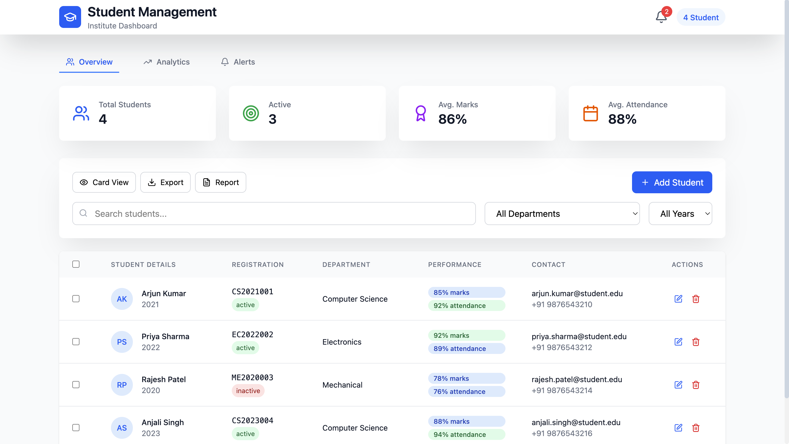
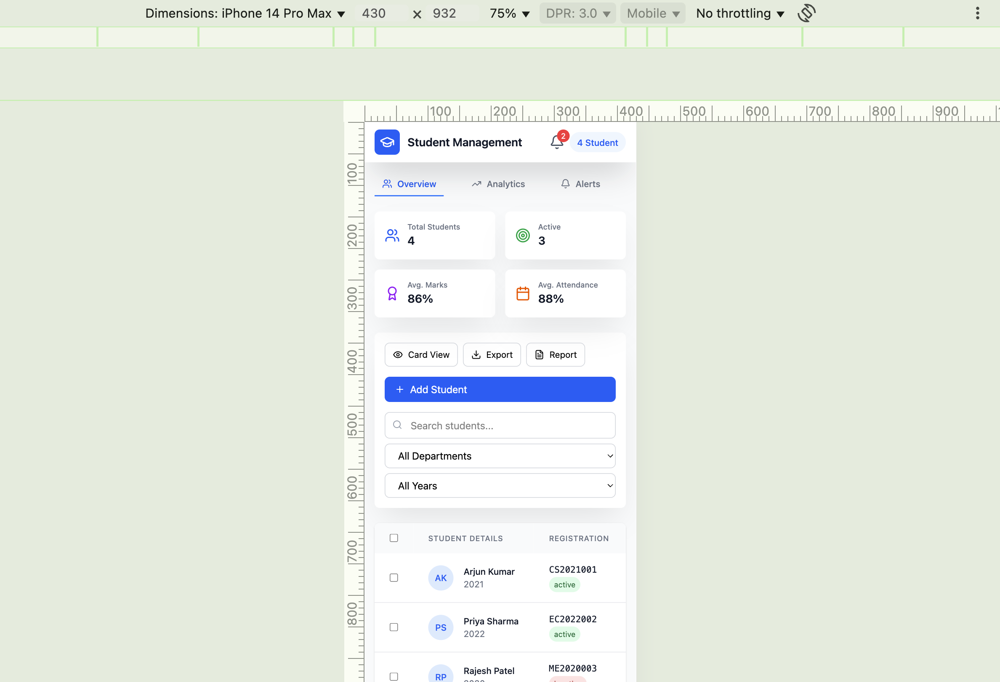

# 🎓 Student Management System

A responsive, Student Management Dashboard built using  **React.js**, and **TailwindCss**, **Vite**,integrated with smart features like analytics, performance tracking, and real-time student status management.


---

Live Link: rise-management.netlify.app

## 🔥 Features

-  **Dashboard Overview**: View total students, active status, average marks, and attendance.
-  **Advanced Filters**: Search by department, year, or student name.
-  **Responsive Design**: Fully optimized for both desktop and mobile (as shown below).
-  **Export & Reporting**: Generate reports and export student data.
-  **Secure CRUD Operations**: Add, update, or delete students with confirmation and role-based authentication.
-  **Performance Stats**: Marks and attendance visual indicators (color-coded).
-  **Alerts & Notifications**: Real-time activity tracking via badges and indicators.

---

## 🧑‍💻 Tech Stack
  React,
  TailwindCss,
  Vite,
  Responsive Design,

---

## Screen Record


## 📱 Screenshots

### 🖥️ Desktop View


### 📱 Mobile Responsive View (iPhone 14 Pro Max)


---

## 🚀 Future Enhancements

-  Interactive Analytics dashboard with D3.js or Recharts
-  Email/Push alerts for attendance and performance drops
-  Voice Assistant integration (OpenAI Whisper)

---

## 🧾 How to Run Locally

```bash

git clone https://github.com/S-Vignesh-Programmer/RISE-Internship-Management

cd frontend

2. Install Dependencies

npm install

Run the Development Server

npm run dev


Author

Vignesh Java Full Stack Developer
For RISE Internship Project Submission


License

This project is licensed for educational use only. Feel free to explore and improve it for your learning!
